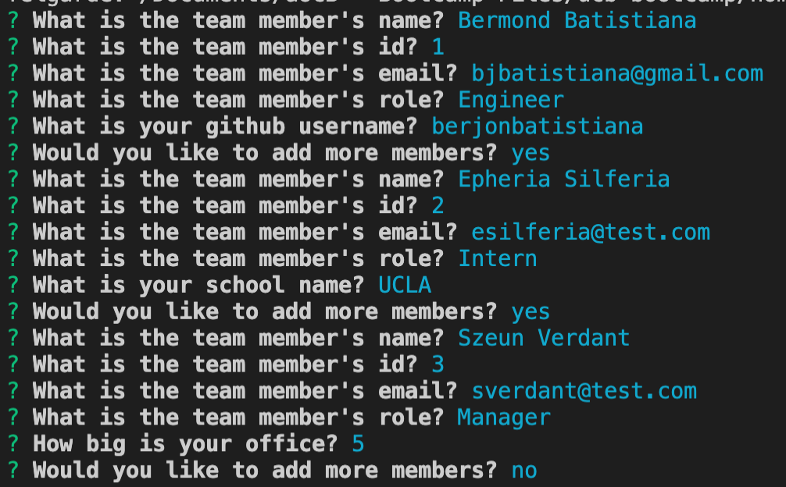
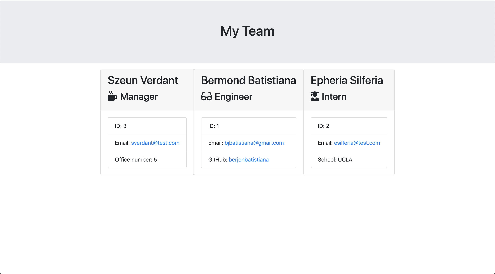

# Team Profile Generator

   


## Description 
This project is used by the Team Lead to log each of their members and have an overview of the team.


## Table of Contents

* [Installation](#installation)
* [Usage](#usage)
* [License](#license)
* [Contributing](#contributing)
* [Tests](#tests)
* [Screenshots](#screenshots)
* [Questions](#questions)


## Installation

Install node and run this command.

```cd Develop;npm i```


## Usage 

To use this project, run the following.

```node Develop/app.js```

## License

No registered license.

## Contributing

No guideline specified yet

## Tests
To test this project, run this in the root.

```cd Develop;npm run test```

## Screenshots




## Questions

Questions? Contact me!


bjbatistiana@gmail.com
